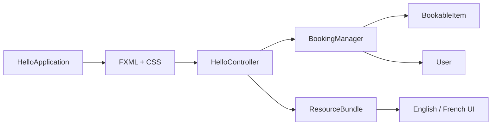

# ZipAbout Rental Management System


A Java/JavaFX desktop rental-management application developed as an individual university software-development project. The project achieved **75%** and demonstrates object-oriented programming, GUI development, design patterns, Java Streams, validation, localisation and accessibility-aware UI design.

## Portfolio highlights

- Built a multi-screen **JavaFX** application using FXML and CSS.
- Modelled users, bookable items and booking behaviour with **object-oriented design**.
- Used a **Singleton** booking manager to coordinate shared application state.
- Applied **Java Streams** for search, lookup, filtering and duplicate checks.
- Added **Admin/User roles**, booking history and loyalty points.
- Added **English/French localisation** with `ResourceBundle`.
- Added light/dark themes, keyboard-accessible interactions and availability visualisation.
- Packaged the project with **Maven** and added automated GitHub build checks.

## Skills demonstrated

| Area | Evidence in the project |
| --- | --- |
| Java | Classes, collections, validation, event handling and business logic |
| OOP | Encapsulation and separation between models, controller and booking logic |
| JavaFX | FXML views, CSS styling, controls, charts and desktop interaction |
| Functional Java | Stream-based filtering, lookup and duplicate checking |
| Design patterns | Singleton `BookingManager` for centralised booking state |
| UX | Search/filtering, role-aware workflows, theming and keyboard interaction |
| Internationalisation | English/French resources via `ResourceBundle` |
| Build tooling | Maven project configuration and JavaFX Maven plugin |
| CI | GitHub Actions compilation on Windows and Ubuntu |

## Core features

### Rental workflow
Users can browse available items, rent/release items and track availability/status changes.

### User accounts and roles
The application includes login behaviour with **Admin** and **User** roles, enabling role-aware functionality.

### Search and filtering
Java Streams are used to support filtering, lookup and duplicate checking across application data.

### Loyalty and booking history
Users can accumulate loyalty points and review booking history as part of the rental workflow.

### Localisation and themes
The interface supports English/French localisation and light/dark theme switching.

### Accessibility and visual feedback
The project includes keyboard-accessible interactions and a pie-chart view for booking availability.

## Architecture



The code is organised around a JavaFX application layer, controller logic, shared booking/business logic and domain models. More detail is available in [`docs/ARCHITECTURE.md`](docs/ARCHITECTURE.md).

## Project structure

```text
.
├── pom.xml
├── README.md
├── .gitignore
├── .github/
│   └── workflows/
│       └── java-ci.yml
├── docs/
│   └── ARCHITECTURE.md
└── src/
    └── main/
        ├── java/
        │   ├── com/example/sd3coursework/
        │   ├── models/
        │   ├── utils/
        │   └── module-info.java
        └── resources/
            └── com/example/sd3coursework/
```

## Quick start

### Requirements

- JDK 21+
- Maven 3.9+

### Run with Maven

```bash
git clone https://github.com/ibrahimm2106/.11.git
cd .11
mvn clean javafx:run
```

### Build only

```bash
mvn clean package
```

The GitHub Actions workflow also verifies that the Maven project compiles on Windows and Ubuntu.

## Suggested demo flow

1. Launch the application.
2. Sign in using one of the available application roles.
3. Search/filter the available rental items.
4. Complete a rental/release action and inspect availability updates.
5. Review user-facing features such as booking history, loyalty points, localisation and theme controls.

## Engineering decisions

<details>
<summary><strong>Why use a Singleton booking manager?</strong></summary>

The booking manager provides one shared point for booking-related state and operations across the application. This demonstrates deliberate use of a design pattern rather than placing business logic directly inside UI code.

</details>

<details>
<summary><strong>Why use Java Streams?</strong></summary>

Streams keep filtering and lookup behaviour concise and demonstrate functional-style operations for searching, duplicate checking and availability filtering.

</details>

<details>
<summary><strong>Why separate FXML/CSS from Java logic?</strong></summary>

The separation keeps presentation concerns away from domain and business logic, improving maintainability and making the JavaFX project easier to navigate.

</details>

## Academic context

This portfolio repository is based on my **Software Development 3** coursework at the University of Roehampton. The project achieved **75%**. The repository is presented as evidence of the Java, JavaFX and software-design skills demonstrated by the implementation.

## Author

**Mohamed Ibrahim**  
BEng Software Engineering, University of Roehampton
