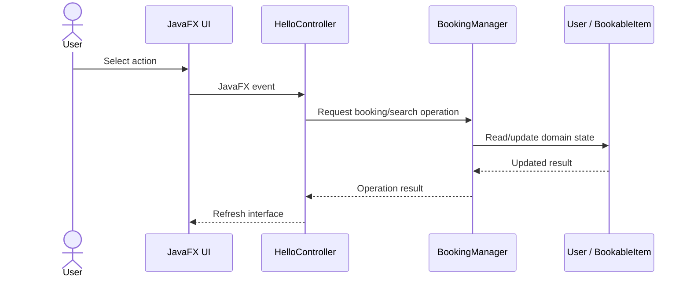

# Architecture

## Overview

ZipAbout is structured as a JavaFX desktop application with presentation, controller, business-logic and model responsibilities separated across the project.

## Main components

### `HelloApplication`
Starts the JavaFX application and loads the initial UI resources.

### FXML and CSS resources
Define the visual structure and styling of the desktop interface separately from Java business logic.

### `HelloController`
Coordinates user interactions, updates the UI and delegates booking-related operations.

### `BookingManager`
Centralises shared booking state and booking operations. The project uses a Singleton approach so the application works with one shared manager instance.

### `BookableItem`
Represents an item that can be rented and tracks the information required by the rental workflow.

### `User`
Represents application users, including role-related information, loyalty points and booking history.

### `ResourceBundle`
Provides localised UI strings for English/French language support.

## High-level flow

## Design qualities demonstrated

- Encapsulation through domain classes.
- Separation of presentation and application logic.
- Shared-state coordination through the Singleton pattern.
- Functional-style collection processing with Java Streams.
- Localisation through resource bundles.
- Maintainable Maven-based project structure.
